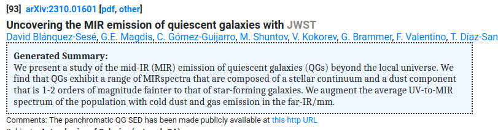
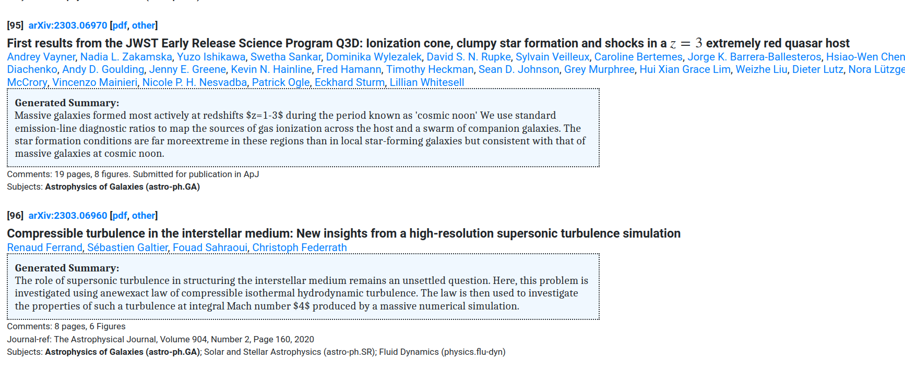

# arxiv-shorts
arxiv-shorts is a firefox extension which displays AI generated summaries of astro-ph.GA abstracts on arXiv.

### Installation

Download the firefox extension .xpi from [here](extension/arxiv-shorts-v012.xpi) and drag-and-drop the downloaded file to firefox to install it. Try it out and if you run into any issues, please report them in the repo. Thanks!

### Features
- Read AI summaries by visiting any arxiv:astro-ph:GA article.

- Want to read AI summaries generated for the entire week? Visit the arxiv [past week](https://arxiv.org/list/astro-ph.GA/pastweek?skip=0&show=500) or [recent page](https://arxiv.org/list/astro-ph.GA/recent). The title of each paper along with the AI generated summary will be displayed for all the papers posted.

