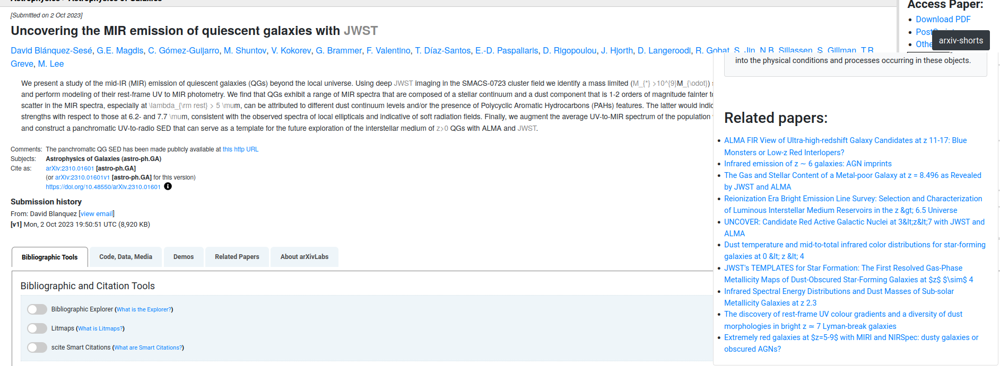

# arxiv-shorts

>A Firefox extension designed to supercharge your arXiv reading experience. Powered by an army of silicon atoms,

Download the extension from the [Firefox addons store](https://addons.mozilla.org/en-US/firefox/addon/arxiv-shorts/).

## Features
This extension adds three key components to each arxiv paper:
- An AI generated summary of the abstract
- A list of concepts needed to understand the abstract, including a brief explanation of their importance and how they are used in the abstract.
- Other relavant papers to read.

 

You can try this extension by visiting any article on astro-ph:GA after October 5, 2023*.

You can also read the summaries for the entire week by visiting the[past week](https://arxiv.org/list/astro-ph.GA/pastweek?skip=0&show=500) or [recent page](https://arxiv.org/list/astro-ph.GA/recent)

## Demo

## Support and development
This extension is currently in beta. Code, suggestions, and feedback are welcome.
