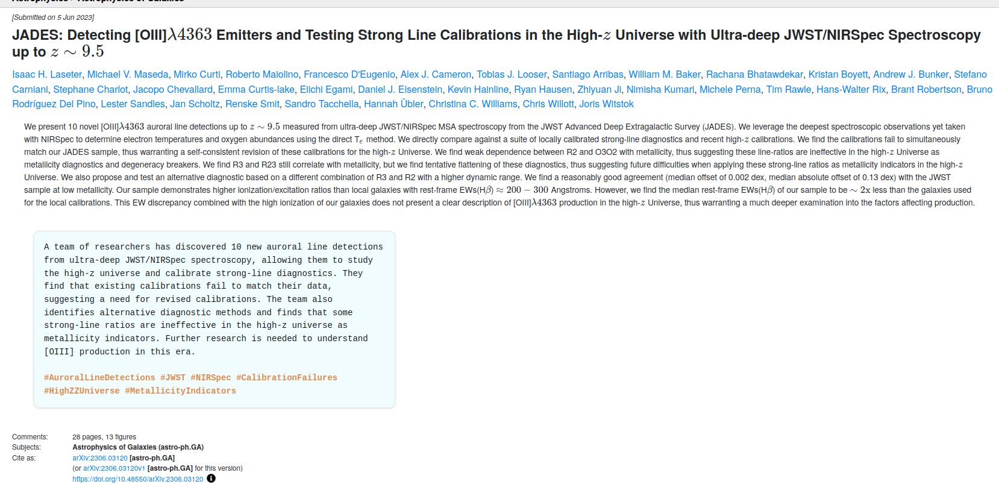
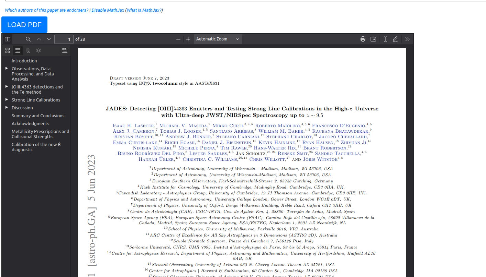

# arxiv-shorts
>A Firefox extension designed to supercharge your arXiv reading experience. Powered by an army of silicon atoms,

The extension is available on [Firefox](https://addons.mozilla.org/en-US/firefox/addon/arxiv-shorts/). and [Chrome (in beta)](https://chromewebstore.google.com/detail/arxiv-shorts/iifmfagbocnledpmfejglaombgneeebi?authuser=0&hl=en-GB).

## Features
This extension adds key components to each arxiv paper:

- A generated summary of the abstract
- Load arxiv pdf on the same page

Example astro-ph:GA article to try out this extension : https://arxiv.org/abs/2306.03120v1

### Status
As of November 2024, core features of this extension are available for >200000 arXiv articles and is updated weekly. 

 
## Buy me a Coffee :coffee:

If you like this project and would like to support this work, please consider [buying me a cup of coffee](https://buymeacoffee.com/509si1f).

#### Support and development
Code, suggestions, and feedback are welcome. Report issues [here](https://github.com/kvgc/arxiv-shorts/issues)

#### Acknowledgements 
Thank you to arXiv for use of its open access interoperability
